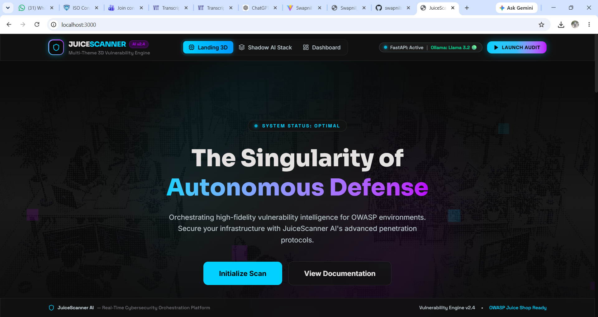
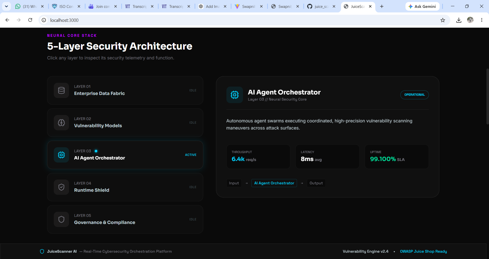
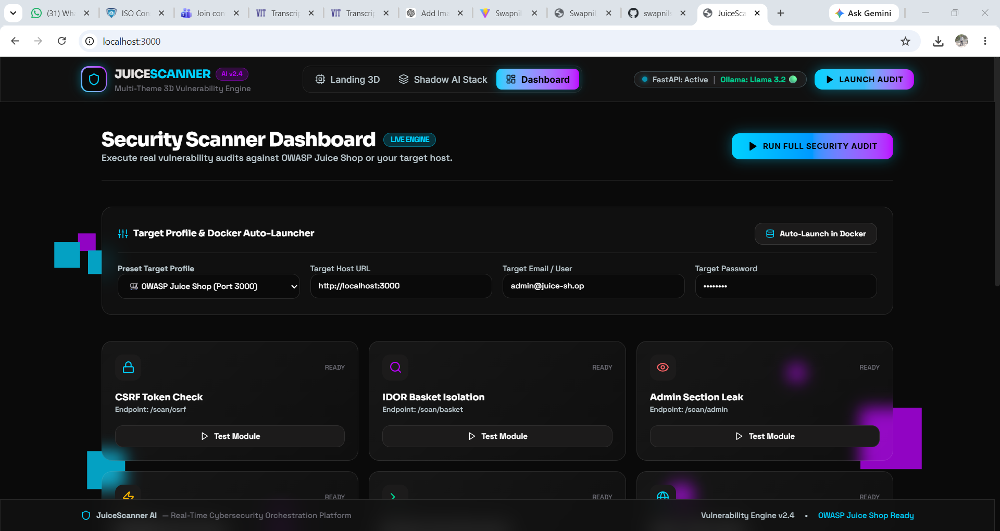

# 🛡️ JuiceScanner AI | Cybersecurity Orchestration & 3D Vulnerability Engine

**JuiceScanner AI** is a full-stack, enterprise-grade cybersecurity scanning and vulnerability intelligence platform designed for **OWASP Juice Shop** environments. Built with a modern **React.js** frontend featuring 3D particle visualizers and an obsidian dark theme, connected to an asynchronous **FastAPI (Python)** security engine integrated with **Local AI (Llama 3.2 via Ollama)** for privacy-first vulnerability analysis.

---

## 🏛️ 5-Layer Security Architecture

The platform is engineered around a **5-Layer Defense-in-Depth Security Model**:

```
┌────────────────────────────────────────────────────────────────────────┐
│  LAYER 05: GOVERNANCE & COMPLIANCE                                     │
│  ➜ app.py (/api/system/status, startup audit) & Navbar.jsx status      │
├────────────────────────────────────────────────────────────────────────┤
│  LAYER 04: RUNTIME SECURITY & API SHIELD                               │
│  ➜ app.py (FastAPI CORSMiddleware, Bearer Auth verification)          │
├────────────────────────────────────────────────────────────────────────┤
│  LAYER 03: AI AGENTS & ORCHESTRATION                                   │
│  ➜ app.py (/api/ai/analyze) + Local Ollama Llama 3.2 Model            │
├────────────────────────────────────────────────────────────────────────┤
│  LAYER 02: VULNERABILITY MODELS                                        │
│  ➜ app.py (/scan/csrf, /scan/basket, /scan/admin, /scan/captcha, etc.)│
├────────────────────────────────────────────────────────────────────────┤
│  LAYER 01: ENTERPRISE DATA FABRIC                                      │
│  ➜ app.py (scan_history log) & DashboardPage.jsx session store         │
└────────────────────────────────────────────────────────────────────────┘
```

### Layer Breakdown
1. **Layer 01 — Enterprise Data Fabric**: Normalizes, stores, and logs diagnostic payloads, scan timestamps, and target host configurations.
2. **Layer 02 — Vulnerability Models**: Dedicated scanning modules evaluating CSRF token enforcement, IDOR Basket access, Admin route leaks, CAPTCHA logic bypass, bot spam rate limiting, and hidden language exposures.
3. **Layer 03 — AI Agents & Orchestration**: Passes diagnostic findings to a local **Llama 3.2** LLM (via Ollama) for automated risk scoring, impact analysis, and remediation guidance.
4. **Layer 04 — Runtime Security & API Shield**: FastAPI CORS middleware and proxy layer handling secure token validation and client-server request isolation.
5. **Layer 05 — Governance & Compliance**: Real-time health monitoring of the scanner engine, target reachability, and local AI model status.

---

## ⚡ Tech Stack

* **Frontend**: React 18, Vite, Three.js (3D Background Particle Canvas), Lucide Icons, Tailwind CSS v4.
* **Backend**: Python 3.10+, FastAPI (ASGI), Pydantic Request Validation, Uvicorn Server, Requests.
* **Local AI**: Ollama (`llama3.2:latest` model).
* **Target Security Lab**: OWASP Juice Shop running in Docker.

---

## 📋 Prerequisites

Before starting, make sure you have installed:
- [Docker Desktop](https://www.docker.com/products/docker-desktop/)
- [Node.js v18+](https://nodejs.org/)
- [Python 3.10+](https://www.python.org/)
- [Ollama](https://ollama.com/)

---

## 🚀 Complete Step-by-Step Guide to Run the Project

### Step 1: Start Docker & Run OWASP Juice Shop Container
1. Open **Docker Desktop** on your system and make sure it is running.
2. Open PowerShell or Terminal and pull/run the OWASP Juice Shop container on port `3000`:

```powershell
# Pull the latest OWASP Juice Shop Docker image
docker pull bkimminich/juice-shop

# Run the container locally on port 3000
docker run -d -p 3000:3000 bkimminich/juice-shop
```

3. Verify Juice Shop is running by visiting **`http://localhost:3000`** in your browser.

---

### Step 2: Start Local Ollama AI Engine (Llama 3.2)
1. Open a new terminal and verify your local models:
```powershell
ollama list
```
*(You should see `llama3.2:latest` in the list)*

2. Start the Ollama background service:
```powershell
ollama serve
```

---

### Step 3: Set Up & Start FastAPI Backend Server
1. Open a new terminal in the project directory:
```powershell
cd c:\Users\DELL\Videos\juice_scaaner-ai
```

2. Create and activate a Python virtual environment:
```powershell
# Create venv
python -m venv venv

# Activate venv (Windows PowerShell)
venv\Scripts\activate
```

3. Install backend dependencies:
```powershell
pip install -r requirements.txt
```

4. Start the FastAPI server:
```powershell
python app.py
```
*Backend active at `http://127.0.0.1:5000` with Swagger API docs at `http://127.0.0.1:5000/docs`*

---

### Step 4: Install & Start React Frontend Server
1. Open a second terminal in the project directory:
```powershell
cd c:\Users\DELL\Videos\juice_scaaner-ai
```

2. Install Node dependencies:
```powershell
npm install
```

3. Start the Vite development server:
```powershell
npm run dev
```

4. Open **`http://localhost:3000`** (or the port displayed by Vite) in your browser!

---

## 🔍 Vulnerability Test Vectors

| Test Vector | Target Endpoint | Description |
| :--- | :--- | :--- |
| **CSRF Token Exploit** | `/rest/user/change-password` | Simulates cross-origin requests from hostile domains to test password modification without valid anti-CSRF tokens. |
| **IDOR Basket Isolation** | `/rest/basket/:id` | Enumerates basket IDs to test whether ownership verification is enforced before serving order payloads. |
| **Admin Privilege Leak** | `/administration`, `/api/Users` | Scans unauthenticated administration paths and user list database endpoints. |
| **CAPTCHA Logic Bypass** | `/rest/captcha/`, `/api/Feedbacks/` | Tests if CAPTCHA solutions are exposed in server JSON responses or reused without invalidation. |
| **Bot Spam Anti-Automation**| `/api/Feedbacks/` | Sends rapid feedback submissions to test rate-limiting headers (`X-RateLimit`, `Retry-After`). |
| **Hidden i18n Leak** | `/assets/i18n/tlh.json` | Discovers secret Klingon language translation assets containing exposed configuration details. |

---

## 🤖 Local Llama 3.2 AI Security Analysis

Once a vulnerability scan completes on the Dashboard:
1. Click **"Analyze with Llama 3.2"**.
2. The FastAPI backend sends the raw diagnostic JSON to your local Ollama instance (`http://localhost:11434/api/generate`).
3. **Llama 3.2** processes the telemetry and generates a 3-bullet executive risk report and remediation guide directly inside your dashboard.

---

## 🛠️ Project File Map

```text
juice_scaaner-ai/
├── app.py                  # FastAPI server, security scan logic & Ollama LLM integration
├── requirements.txt        # Python dependencies (fastapi, uvicorn, pydantic, requests)
├── package.json            # Node.js dependencies & scripts
├── vite.config.js          # Vite config with API proxy to port 5000
├── index.html              # Root HTML template with Google Fonts (Sora, Inter, Space Grotesk)
├── src/
│   ├── main.jsx            # React root entrypoint
│   ├── App.jsx             # Shell container, tab routing & scroll resets
│   ├── index.css           # Obsidian dark design system tokens & glassmorphism
│   ├── components/
│   │   ├── Navbar.jsx      # Header bar with live FastAPI & Ollama Llama 3.2 status pill
│   │   └── ThreeCanvas.jsx # Three.js animated background particle canvas
│   └── pages/
│       ├── LandingPage.jsx     # 3D Landing Page with architectural backdrop & stack visualizer
│       ├── ArchitecturePage.jsx# 5-Layer Security Architecture & Threat Matrix Inspector
│       └── DashboardPage.jsx   # Live Security Audit suite connected to FastAPI & Llama 3.2
└── README.md               # Project documentation
```

---

## 🤝 Troubleshooting

* **Docker container port in use**: If port 3000 is occupied, stop existing containers using `docker stop $(docker ps -q)`.
* **Ollama Offline in Navbar**: Ensure `ollama serve` is running or launch Ollama Desktop from your Windows Start Menu.
* **FastAPI Port Conflicts**: FastAPI defaults to port `5000`. Ensure no other local service is using port 5000.







